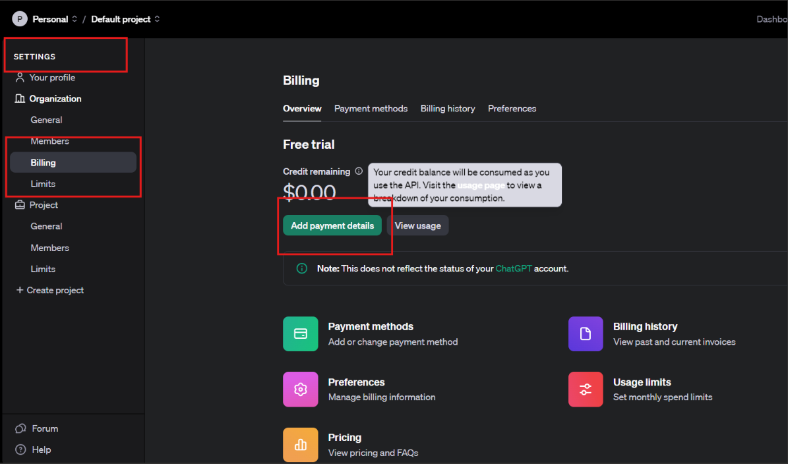

# Entity Disambiguation in Local News Texts using Dedicated Geoparsers and LLMs


# Abstract

Entity disambiguation, the task of resolving ambiguities in text to map entities to specific, unique identifiers (e.g., geocoordinates for toponyms), has been a critical challenge in natural language processing (NLP). Over the years, several state-of-the-art tools have emerged to tackle this problem. Traditional systems like Mordecai3, Cliff Clavin, the Edinburgh Parser, and DBpedia Spotlight rely on structured rule-based methods, knowledge bases, and statistical models. These tools have demonstrated substantial success, particularly when paired with domain-specific datasets. However, they often struggle with the nuanced understanding of context required for resolving complex ambiguities.

With the recent advancements in artificial intelligence, particularly Large Language Models (LLMs), a paradigm shift is underway. Models like GPT, Llama, and other foundation models have showcased remarkable capabilities in contextual reasoning, making them increasingly viable alternatives for tasks like entity disambiguation. These LLMs excel in leveraging both explicit information and subtle contextual cues, often surpassing traditional methods in accuracy and flexibility. However, despite their superior performance, LLMs come with significant computational costs. They require substantial computational resources, often necessitating GPUs with high memory capacities, and may take a long time to run, especially when processing large datasets. This makes them less practical for real-time applications unless powerful hardware and optimized pipelines are in place.

This repository evaluates the application of LLMs for entity disambiguation, specifically for toponyms found in local news texts, and compares their performance against established tools. The results offer insights into how LLMs can redefine the state of the art in entity disambiguation, while also providing researchers and practitioners with resources and guidelines for leveraging these models effectively.

# Using Windows? Read this.

I use a Windows 11 PC, however, throughout this project, I found the powershell extremely difficult to use for testing these tools, mostly because a lot of them were created with Linux or Mac users in mind. To make like easier for you as a Windows users, I recommend the following steps: 

1. Install Windows Subsystem for Linux (WSL) via Powershell (ensure you open as Admin)
```powershell
wsl --install
```
2. Install a Linux distribution: installing WSL may also install Ubuntu but if not, you can open the Microsoft store app and search for WSL. You will find a bunch of linux distributions. I use Ubuntu. Debian is another option.

3. Set up the linux distribution. You will need to create a username and password (make sure to save or memorize these).

4. Now you have an Ubuntu terminal that you can run linux commands in.

5. To access Windows files from Ubuntu, do this via the **/mnt/c** directory like this:
```bash
cd /mnt/c/Users/YourWindowsUsername/WindowsFolder/filename.txt
```

All the tools and commands below were run using Ubuntu terminal via WSL, except when explicitly stated otherwise.

# State-of-the-Art Geoparsers

## Datasets (Gold standards)
[text](data/gold_standards)

There are 3 in total, one for GPE, LOC, and FAC entities. The ambiguous toponyms were manually geocoded using Google, Geonames, or OpenStreetMap. They were randomly scraped from local news sites in all 50 states. They are all made of 100 objects, 2 from each US state. 

Each JSONL file is designed to provide both the geolocation information of various entities and the context in which these entities are mentioned. 
- Gold standard files are in the format: `*.TOPO_2023-06-07T160700Z.jsonl` where TOPO = GPE or LOC or FAC

- Each line (i.e., each JSON object) represents a geographical entity and its context.
- Each entry has `lat_long` field with latitude and longitude values, indicating the geographic location related to the entry.

- The `entity` field represents a geographic entity (like "Newfane" or "Pennsylvania"), and the `entity_label` field contains a label for this entity, such as "GPE" (Geopolitical Entity).

- The `context` field contains contextual information where the entity is mentioned. This includes the sentences (`sents`) where the entity is mentioned.
- Other Information:
    - The `link` field provides a URL to the source of the information.
    - The `title` field contains the title of the source material.
    - Additional fields like published, `link_extracted_from`, and `media_dets` provide more context about the source, such as the publishing date, where the link was extracted from, and details about the media outlet.

## Installation and Usage

### 1. GATE YODIE
https://cloud.gate.ac.uk/info/help/online-api.html

- Create an account at https://cloud.gate.ac.uk/login/full
- Request an API key
- Once you have the API key ID and password, make a HTTPS Header request to the API endpoint: https://cloud-api.gate.ac.uk/process/yodie-en

First convert your API ID and password to base64:

```bash
$ echo -n "api-id" | base64
```

Example header request:
```bash
curl -X POST -H "Authorization: Basic base64-api-id" -H "Content-Type: text/plain" -H "Accept: application/json" -m 60 --data-binary @example.txt https://cloud-api.gate.ac.uk/process/yodie-en -o output.json
```
Programmatically, you can use the python `requests` library to do this:
```py
import requests

url = "https://cloud-api.gate.ac.uk/process/yodie-en"
headers = {
    "Authorization": "Basic base64-api-id",
    "Content-Type": "text/plain",
    "Accept": "application/json"
}

requests.post(url, headers=headers, data={text}, timeout=60)
```
Output:
```json
{
    "text": "The University of Oklahoma has received a  million gift from Delta Dental of Oklahoma and Delta Dental of Oklahoma Foundation to the OU College of Dentistry to fund a dental clinic on the OU-Tulsa campus.",
    "entities": {
        "Mention": [
            {
                "indices": [
                    4,
                    26
                ],
                "inst": "http://dbpedia.org/resource/University_of_Oklahoma",
                "dbpInterestingClasses": "dbpedia-owl:Organisation|dbpedia-owl:Person",
                "dbpSpecificClasses": "dbpedia-owl:College|dbpedia-owl:Person",
                "confidence": 0.53
            },
            {
                "indices": [
                    61,
                    73
                ],
                "inst": "http://dbpedia.org/resource/Delta_Dental",
                "dbpInterestingClasses": "owl:Thing",
                "dbpSpecificClasses": "owl:Thing",
                "confidence": -0.8
            },
            {
                "indices": [
                    90,
                    102
                ],
                "inst": "http://dbpedia.org/resource/Delta_Dental",
                "dbpInterestingClasses": "owl:Thing",
                "dbpSpecificClasses": "owl:Thing",
                "confidence": -0.8
            },
            {
                "indices": [
                    188,
                    196
                ],
                "inst": "http://dbpedia.org/resource/University_of_Oklahoma",
                "dbpInterestingClasses": "dbpedia-owl:Organisation|dbpedia-owl:Person",
                "dbpSpecificClasses": "dbpedia-owl:College|dbpedia-owl:Person",
                "confidence": 0.5016904761904762
            }
        ]
    }
}
```
Dbpedia entities are returned so further parsing is required to get the coordinates.

**Note:** You can make 800 free header requests a day.


### 2. Geoparsepy (using windows terminal pipenv)
https://github.com/stuartemiddleton/geoparsepy
### Installation:
- Download Postgre: when you install, you will be asked to give a password, take note of this, also you will be asked to select a port: choose  5432 https://www.enterprisedb.com/downloads/postgres-postgresql-downloads
- Install the geoparsepy library

```bash
pip install geoparsepy
```

Installing the library should also automatically install psycopg2>=2.8 nltk>=3.4 numpy>=1.18 shapely>=1.6 setuptools>=46 soton-corenlppy>=1.0 
but if not, install those also using pip.
Download NLTK corpora:

```python
import nltk
nltk.download('names')
nltk.download('stopwords')
nltk.download('wordnet')
```

- Download pre-processed UTF-8 encoded SQL table dumps:
    - download zip file from Google drive: https://drive.google.com/file/d/1xyCjQox6gCoN8e0upHHyeMLV-uLirthS/view?usp=sharing
- Then unzip the files manually or by running the following in bash
```bash
unzip geoparsepy_preprocessed_tables.tar.zip
tar -xvf geoparsepy_preprocessed_tables.tar
```


- Create openstreetmap database and extensions by running this in psql:
```sql
psql -U postgres
CREATE DATABASE openstreetmap;
CREATE EXTENSION IF NOT EXISTS postgis;
CREATE EXTENSION IF NOT EXISTS fuzzystrmatch;
CREATE EXTENSION IF NOT EXISTS postgis_tiger_geocoder;
CREATE EXTENSION IF NOT EXISTS hstore;
```

Alternatively, open pgAdmin, click Databases and then Create. Put the database name and save. While still in the app, select your database, click the psql tool icon and run the create extension commands above.

- Import the precomputed database tables for global cities and places. In powershell, navigate to the folder where your SQL tables are saved and run the following:
```powershell
& 'C:\Program Files\PostgreSQL\16\bin\psql' -U postgres -d openstreetmap -f global_cities.sql
& 'C:\Program Files\PostgreSQL\16\bin\psql' -U postgres -d openstreetmap -f uk_places.sql
& 'C:\Program Files\PostgreSQL\16\bin\psql' -U postgres -d openstreetmap -f north_america_places.sql
& 'C:\Program Files\PostgreSQL\16\bin\psql' -U postgres -d openstreetmap -f europe_places.sql
```

Ran the example code from the github repo and got the same results. Note in example.py, there’s a line: 
```py
databaseHandle = soton_corenlppy
                .PostgresqlHandler
                .PostgresqlHandler('postgres', 'password', 
                                 'localhost', 5432, 
                                 'openstreetmap', 600)
```

The 2nd string is password, so change it to whatever password you chose when downloading PostgreSQL.

Note: Geoparsepy returns OSM IDs, not coordinates, so there is need to convert these. The Overpass API performs this process.
```py
import requests 

overpass_url = "http://overpass-api.de/api/interpreter"
overpass_query = f"""
    [out:json];
    {osm_type}({osm_id});
    out geom;
    """
requests.get(overpass_url, params={'data': overpass_query})
```

### 3. Cliff-Clavin
https://github.com/mediacloud/cliff-annotator
https://pypi.org/project/mediacloud-cliff/

- Make sure Docker Desktop is running
- In Bash, run this:
```bash
docker run -p 8080:8080 -m 8G --platform=linux/amd64 -d rahulbot/cliff-clavin:2.6.1
```
- Run `'http://localhost:8080/cliff-2.6.1/parse/text?q={text_for_parsing}`

To use Cliff programmatically, install it using pip:

```bash
pip install mediacloud-cliff
```
Then instantiate and use it like this:

```py
from cliff.api import Cliff
my_cliff = Cliff('http://myserver.com:8080')
my_cliff.parse_text("This is about Einstien at the IIT in New Delhi.")
```
Output:
```json
{
  "results": {
    "organizations": [
      {
        "count": 1,
        "name": "IIT"
      }
    ],
    "places": {
      "focus": {
        "cities": [
          {
            "id": 1261481,
            "lon": 77.22445,
            "name": "New Delhi",
            "score": 1,
            "countryGeoNameId": "1269750",
            "countryCode": "IN",
            "featureCode": "PPLC",
            "featureClass": "P",
            "stateCode": "07",
            "lat": 28.63576,
            "stateGeoNameId": "1273293",
            "population": 317797
          }
        ],
        "states": [
          {
            "id": 1273293,
            "lon": 77.1,
            "name": "National Capital Territory of Delhi",
            "score": 1,
            "countryGeoNameId": "1269750",
            "countryCode": "IN",
            "featureCode": "ADM1",
            "featureClass": "A",
            "stateCode": "07",
            "lat": 28.6667,
            "stateGeoNameId": "1273293",
            "population": 16787941
          }
        ],
        "countries": [
          {
            "id": 1269750,
            "lon": 79,
            "name": "Republic of India",
            "score": 1,
            "countryGeoNameId": "1269750",
            "countryCode": "IN",
            "featureCode": "PCLI",
            "featureClass": "A",
            "stateCode": "00",
            "lat": 22,
            "stateGeoNameId": "",
            "population": 1173108018
          }
        ]
      },
      "mentions": [
        {
          "id": 1261481,
          "lon": 77.22445,
          "source": {
            "charIndex": 37,
            "string": "New Delhi"
          },
          "name": "New Delhi",
          "countryGeoNameId": "1269750",
          "countryCode": "IN",
          "featureCode": "PPLC",
          "featureClass": "P",
          "stateCode": "07",
          "confidence": 1,
          "lat": 28.63576,
          "stateGeoNameId": "1273293",
          "population": 317797
        }
      ]
    },
    "people": [
      {
        "count": 1,
        "name": "Einstien"
      }
    ]
  },
  "status": "ok",
  "milliseconds": 22,
  "version": "2.6.0"
}
```

### 4. DBpedia Spotlight
https://github.com/dbpedia-spotlight/dbpedia-spotlight-model

- Go to Bash terminal and run curl command 
- Eg: 
```bash
curl https://api.dbpedia-spotlight.org/en/annotate  \
  --data-urlencode "text=The University of Oklahoma has received a $2 million gift from Delta Dental of Oklahoma and Delta Dental of Oklahoma Foundation to the OU College of Dentistry to fund a dental clinic on the OU-Tulsa campus." \
  --data "confidence=0.35" \
  -H "Accept: application/json"
```
Output:
```json
{
    "@text": "The University of Oklahoma has received a  million gift from Delta Dental of Oklahoma and Delta Dental of Oklahoma Foundation to the OU College of Dentistry to fund a dental clinic on the OU-Tulsa campus.",
    "@confidence": "0.35",
    "@support": "0",
    "@types": "",
    "@sparql": "",
    "@policy": "whitelist",
    "Resources": [
        {
            "@URI": "http://dbpedia.org/resource/Oklahoma",
            "@support": "47520",
            "@types": "Wikidata:Q3455524,Schema:Place,Schema:AdministrativeArea,DBpedia:Region,DBpedia:PopulatedPlace,DBpedia:Place,DBpedia:Location,DBpedia:AdministrativeRegion",
            "@surfaceForm": "Oklahoma",
            "@offset": "18",
            "@similarityScore": "0.7628718792600525",
            "@percentageOfSecondRank": "0.31083199190989347"
        },
        {
            "@URI": "http://dbpedia.org/resource/Delta_Dental",
            "@support": "31",
            "@types": "Wikidata:Q4830453,Wikidata:Q43229,Wikidata:Q24229398,DUL:SocialPerson,DUL:Agent,Schema:Organization,DBpedia:Organisation,DBpedia:Agent,DBpedia:Company",
            "@surfaceForm": "Delta Dental",
            "@offset": "61",
            "@similarityScore": "0.9999999999943725",
            "@percentageOfSecondRank": "0.0"
        },
        {
            "@URI": "http://dbpedia.org/resource/Oklahoma",
            "@support": "47520",
            "@types": "Wikidata:Q3455524,Schema:Place,Schema:AdministrativeArea,DBpedia:Region,DBpedia:PopulatedPlace,DBpedia:Place,DBpedia:Location,DBpedia:AdministrativeRegion",
            "@surfaceForm": "Oklahoma",
            "@offset": "77",
            "@similarityScore": "0.7628718792600525",
            "@percentageOfSecondRank": "0.31083199190989347"
        },
        {
            "@URI": "http://dbpedia.org/resource/Delta_Dental",
            "@support": "31",
            "@types": "Wikidata:Q4830453,Wikidata:Q43229,Wikidata:Q24229398,DUL:SocialPerson,DUL:Agent,Schema:Organization,DBpedia:Organisation,DBpedia:Agent,DBpedia:Company",
            "@surfaceForm": "Delta Dental",
            "@offset": "90",
            "@similarityScore": "0.9999999999943725",
            "@percentageOfSecondRank": "0.0"
        },
        {
            "@URI": "http://dbpedia.org/resource/Oklahoma",
            "@support": "47520",
            "@types": "Wikidata:Q3455524,Schema:Place,Schema:AdministrativeArea,DBpedia:Region,DBpedia:PopulatedPlace,DBpedia:Place,DBpedia:Location,DBpedia:AdministrativeRegion",
            "@surfaceForm": "Oklahoma",
            "@offset": "106",
            "@similarityScore": "0.7628718792606812",
            "@percentageOfSecondRank": "0.31083199190989347"
        },
        {
            "@URI": "http://dbpedia.org/resource/Dentistry",
            "@support": "2650",
            "@types": "",
            "@surfaceForm": "Dentistry",
            "@offset": "147",
            "@similarityScore": "0.987982005348338",
            "@percentageOfSecondRank": "0.011775576756809526"
        },
        {
            "@URI": "http://dbpedia.org/resource/Dentistry",
            "@support": "2650",
            "@types": "",
            "@surfaceForm": "dental clinic",
            "@offset": "167",
            "@similarityScore": "0.9962130354336799",
            "@percentageOfSecondRank": "0.003801360182647971"
        }
    ]
}
```
The same outcome will be gotten by using the `requests` library to send a POST request.


### 5. Edinburgh Geoparser
https://www.ltg.ed.ac.uk/software/geoparser/

### Installation
- Download WSL and Ubuntu
- Download geoparser-1.3.tar.gz from https://www.ltg.ed.ac.uk/software/geoparser/ and extract
- Navigate to the Script Directory in terminal
- Run an example text file
```bash
cat ../in/example.txt | ./run -t plain -g geonames -o ../out example
```
Command options:
```
Input type
-t   plain          (plain text)
     ltgxml         (xml file in a certain format with paragraphs marked up)
     gb             (Google Books html files)

Gazetteer options

-g   unlock         (Edina's Unlock gazetteer)
     os             (Just the OS part of Unlock)
     naturalearth   (Just the Natural Earth part of Unlock)
     unlockgeonames (Just the GeoNames part of Unlock)
     geonames       (online world-wide gazetteer)
     plplus         (Pleiades+ gazetteer of ancient places)
     deep           (DEEP gazetteer of historical placenames in England)

     [ geonames-local (locally maintained copy on ed.ac.uk network) ]
     [ plplus-local   (locally maintained Pleiades+, with geonames lookup) ]

-l lat long radius score (use this if you know what geographical area your ambiguous toponym is likely to be in)
```


### 6. Mordecai3
https://github.com/ahalterman/mordecai3

- Install these: mordecai, wget

```bash 
$ pip install textacy mordecai3 unzip
```

If you ran into error: `DocTransformerOutput' object has no attribute 'tensors'`, resolve by rolling back spacy:
```bash
pip install spacy==3.6.1
pip install https://github.com/explosion/spacy-models/releases/download/en_core_web_trf-3.6.1/en_core_web_trf-3.6.1.tar.gz
```

Create a Geonames index running locally in Elasticsearch container (make sure Docker Desktop is open, and resources integration for Ubuntu is selected).
```bash
$ git clone https://github.com/openeventdata/es-geonames.git
$ cd es-geonames
$ bash create_index.sh
```
Make sure this completes successfully. 

To test, open python in your terminal (ubuntu) and run the below:

```py
>>> from mordecai3 import Geoparser
>>> geo = Geoparser()
>>> geo.geoparse_doc("I visited Alexanderplatz in Berlin.")
```
Output:

```json
{"doc_text": "I visited Alexanderplatz in Berlin.", "event_location_raw": "", "geolocated_ents": [
        {
            "feature_code": "SQR",
            "feature_class": "S",
            "country_code3": "DEU",
            "lat": 52.5225,
            "lon": 13.415,
            "name": "Alexanderplatz",
            "admin1_code": "16",
            "admin1_name": "Berlin",
            "admin2_code": "00",
            "admin2_name": "",
            "geonameid": "6944049",
            "admin1_parent_match": 0,
            "country_code_parent_match": 0,
            "alt_name_length": 3.1354942159291497,
            "min_dist": 0.0,
            "max_dist": 0.16216216216216217,
            "avg_dist": 0.21824381926683717,
            "ascii_dist": 0.0,
            "adm1_count": 1.0,
            "country_count": 1.0,
            "score": 1.0,
            "search_name": "Alexanderplatz",
            "start_char": 10,
            "end_char": 24,
            "city_id": "",
            "city_name": ""
        },
        {
            "feature_code": "PPLC",
            "feature_class": "P",
            "country_code3": "DEU",
            "lat": 52.52437,
            "lon": 13.41053,
            "name": "Berlin",
            "admin1_code": "16",
            "admin1_name": "Berlin",
            "admin2_code": "00",
            "admin2_name": "",
            "geonameid": "2950159",
            "admin1_parent_match": 0,
            "country_code_parent_match": 0,
            "alt_name_length": 4.0943445622221,
            "min_dist": 0.0,
            "max_dist": 0.14492753623188406,
            "avg_dist": 0.09058940069341258,
            "ascii_dist": 0.0,
            "adm1_count": 1.0,
            "country_count": 1.0,
            "score": 0.9999998807907104,
            "search_name": "Berlin",
            "start_char": 28,
            "end_char": 34,
            "city_id": "2950159",
            "city_name": "Berlin"
        }
    ]
}
```

Once built, the index can be started like this:
```bash
docker run -d -p 127.0.0.1:9200:9200 -e "discovery.type=single-node" 
-v $PWD/geonames_index/:/usr/share/elasticsearch/data elasticsearch:7.10.1
```

## State of the Art Evaluation

### GPE (Gold standard: GPE_2023-06-07T160700Z.jsonl)
|| Mordecai3 | Edinburgh Geoparser | Geoparsepy | Cliff Clavin | Gate Yodie | Dbpedia Spotlight
|---|---|---|---|---|---|---|
|**Precision**| 0.595 | 0.356 | 0.292 | 0.375 | 0.425 | 0.381 
|**Recall**| 0.611 | 0.727 | 0.824 | 0.857 | 0.607 | 0.640 
|**F1**| 0.603 | 0.478 | 0.431 | 0.522 | 0.500 | 0.478 


### LOC (Gold standard: LOC_2023-06-07T160700Z.jsonl)
|| Mordecai3 | Edinburgh Geoparser | Geoparsepy | Cliff Clavin | Gate Yodie | Dbpedia Spotlight
|---|---|---|---|---|---|---|
|**Precision**| 0.321 | 0.282 | 0.316 | 0.475 | 0.308 | 0.409 
|**Recall**| 0.281 | 0.478 | 0.480 | 0.633 | 0.500 | 0.720 
|**F1**| 0.300 | 0.355 | 0.381 | 0.543 | 0.381 | 0.522 


### FAC (Gold standard: FAC_2023-06-07T160700Z.jsonl)
|| Mordecai3 | Edinburgh Geoparser | Geoparsepy | Cliff Clavin | Gate Yodie | Dbpedia Spotlight
|---|---|---|---|---|---|---|
|**Precision**| 0.341 | 0.235 | 0.244 | 0.355 | 0.432 | 0.234 
|**Recall**| 0.583 | 0.32 | 0.5 | 0.355 | 0.731 | 0.733 
|**F1**| 0.431 | 0.271 | 0.328 | 0.355 | 0.543 | 0.355 


# Large Language Models

A total of 5 LLMs were tested in various ways. GPT 4o was tested using the API for a fee. Others were tested via HuggingFace, some of which were fine-tuned prior to testing. The finetuned models (Llama27b, Llama213b, and Mistral7b) were sourced from https://github.com/uhuohuy/LLM-geocoding/blob/main/README.md. The authors trained 5 LLMs on comprehensive datasets derived from news articles, tweets, Wikipedia, etc. Read the full paper [here](https://www.tandfonline.com/doi/full/10.1080/13658816.2024.2405182). Their data, training and testing code can all be found in the github repo linked above.

## gpt-4o-mini

### Requirements
- Create an account on OpenAI's development platform (https://platform.openai.com/)
- Go to Settings. Under Organization, select Billing. There click Add payment details.

    

- Fill in necessary info (such as payment information, etc)
- Select credit limit (has upper limit of 100 dollars), and if selecting auto-renewal, choose when to do so and amount to renew with.
- You can perform tasks in the user iterface, or you can create an API key (with necessary permissions) [here](https://platform.openai.com/api-keys) to use in code.
- You can view your usage details, how much credit you have left, etc on the [dashboard]([https://platform.openai.com/usage)

### Usage (Python)

```py
client = OpenAI(api_key = 'api-key') # replace with your api key
messages = [
    {"role": "user", "content": "your-prompt-here"}
]
response = client.chat.completions.create(
    model="gpt-4o-mini", # use preferred model
    messages=messages,
    max_tokens=200
)
```

Complete code can be found in the models folder.
Using this API is really fast and efficient. Takes seconds to a few minutes for hundreds of data. Good for those who want quick results and don't mind the money.

## Llama2-7B 

This model was developed by Meta. It can be accessed via HuggingFace in 2 ways:

- Pipeline
```py
# Use a pipeline as a high-level helper
from transformers import pipeline

messages = [
    {"role": "user", "content": "prompt-here"},
]
pipe = pipeline("text-generation", model="meta-llama/Llama-2-7b-chat-hf")
pipe(messages)
```

- Directly
```py
# Load model directly
from transformers import AutoTokenizer, AutoModelForCausalLM

tokenizer = AutoTokenizer.from_pretrained("meta-llama/Llama-2-7b-chat-hf")
model = AutoModelForCausalLM.from_pretrained("meta-llama/Llama-2-7b-chat-hf")
```

* *Note: You need to have a HuggingFace account, access to the model, and an access token. You can request access from the model [card](https://huggingface.co/meta-llama/Llama-2-7b-chat-hf). And you can create an access token with needed permissions here: https://huggingface.co/settings/tokens. This functions similarly to an API key. You can use one access token for as many models you want.*

Here, however, we went further by using a fine-tuned version of the model. The model uses **meta-llama/Llama-2-7b-chat-hf** as a base models and builds on top of it by training it on geographic entities within texts.

- Start by loading the model and saving it
```py
from transformers import AutoModelForCausalLM, AutoTokenizer
from peft import PeftModel

# Load the base model and tokenizer
model = AutoModelForCausalLM.from_pretrained("meta-llama/Llama-2-7b-chat-hf")
tokenizer = AutoTokenizer.from_pretrained("meta-llama/Llama-2-7b-chat-hf")

# Load LoRA weights for toponym resolution
model = PeftModel.from_pretrained(model, "xukehu/Llama2-7B-LoRA-Toponym-Resolution")

model.save_pretrained("path_of_the_lora_weights")
```

- Run the prediction.py in your terminal. Ensure to edit the code to run on your dataset 
```bash
$BASE_MODEL="meta-llama/Llama-2-7b-chat-hf"
$LORA_WEIGHTS="path_of_the_lora_weights" 

python prediction.py --load_8bit False --base_model "$BASE_MODEL" --lora_weights "$LORA_WEIGHTS" 
```

https://huggingface.co/xukehu/Llama2-7B-LoRA-Toponym-Resolution

https://github.com/uhuohuy/LLM-geocoding/blob/fbb8750f68bd5f605ed074d1d042c58118b0268e/prediction.py
what we want to accomplish: systems: dedicated geoparsers and LLMs
LLMs: requirements, installation, usage
datsets, testing show table

### Non finetuned

## Results
Highlight key findings. Include summary statistics or plots.

## GPE
|| Llama27b|Mistral7b|Llama213b|
|---|---|---|---|
|**Precision**| 0.8586|0.85|0.8788
|**Recall**| 0.9659 |0.977|0.9667
|**F1**| 0.9096|0.909|0.9188

## LOC
|| Llama27b|Mistral7b|Llama213b|
|---|---|---|---|
|**Precision**| 0.5281|0.5778|0.5435
|**Recall**| 0.7833|0.8125|0.8333
|**F1**| 0.6297|0.6757|0.6577

## FAC
|| Llama27b|Mistral7b|Llama213b|
|---|---|---|---|
|**Precision**| 0.7561|0.8429|0.8
|**Recall**| 0.7561|0.6484|0.7442
|**F1**| 0.7561|0.7323|0.7707


# References

Fine-tuned models Llama2-7B, Llama2-13B, Mistral7B were developed Hu et al.
@article{hu2024toponym,
  title={Toponym resolution leveraging lightweight and open-source large language models and geo-knowledge},
  author={Hu, Xuke and Kersten, Jens and Klan, Friederike and Farzana, Sheikh Mastura},
  journal={International Journal of Geographical Information Science},
  pages={1--28},
  year={2024},
  publisher={Taylor & Francis}
}